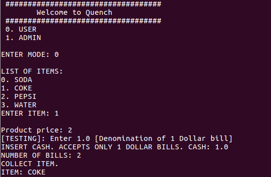
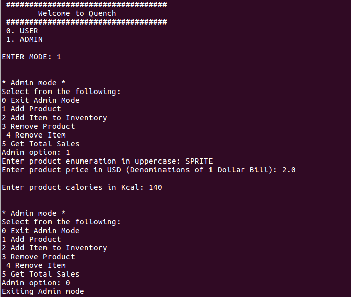
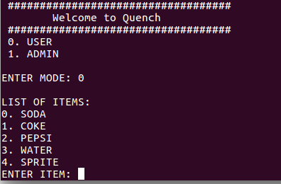

# vending_machine

This repository implements a simple prototype of vending machine. Factory design pattern was used in order to allow for creating different kings of vending machines.

## Some of the properties of vending machine

- Allows user to select products for example SODA, COKE, PEPSI, WATER
- Accepts 1 dollar bills
- Dispenses the selected product after successfull transaction
- Allows the admin to add a new product to the vending machine and deprecate a product
- Allows the admin to add and remove quantity of existing products
- Allows the admin to add a new product to the vending machine and deprecate denominations
- Allows the admin to add and remove quantity of products
- Allows the admin to reset the machine to factory state

## Assumptions/ Limitations
- Only one user at a time (No multi-threading)
- Accepts only dollar 1 bills (More denominations can be added)
- The machine can dispense only 1 item per transaction
- User has sufficient amount
- No security or authorization is being checked for admins
- No data base of the transaction history is being currently maintained

## Implementation

The main program in under the `src` directory.

- `main.cpp` - Implements a GUI/ Testing for the `VendingMachine` abstract class
- `vending_machine.h` and `vending_machine.cpp` - Abstract class for vending machine
- `vending_machine_implementation.h` and `vending_machine_implementation.cpp`  - Implements the abstracted methods for the vending machine
- `inventory.h` and `inventory.hpp`- Implements a templated class for inventory used for both cash and item
- `cash.h`and `cash.cpp` - Implements the user defined cash data type
- `item.h`and `item.cpp` - Implements the user defined item data type
- `types.h` - Defines commmonly user data types

## TEST SCREENSHOTS

The user selects item, pays cash, and collects the item.

The admin adds new product SPRITE to the product list (dynamic enumeration)

The new product being displayed to the user.

## Dependencies

* cmake >= 3.5
  * All OSes: [click here for installation instructions](https://cmake.org/install/)
* make >= 4.1 (Linux, Mac), 3.81 (Windows)
  * Linux: make is installed by default on most Linux distros
  * Mac: [install Xcode command line tools to get make](https://developer.apple.com/xcode/features/)
  * Windows: [Click here for installation instructions](http://gnuwin32.sourceforge.net/packages/make.htm)
* gcc/g++ >= 5.4
  * Linux: gcc / g++ is installed by default on most Linux distros
  * Mac: same deal as make - [install Xcode command line tools](https://developer.apple.com/xcode/features/)
  * Windows: recommend using [MinGW](http://www.mingw.org/)

## Build

1. Clone this repo.
2. Make a build directory: `mkdir build && cd build`
3. Compile: `cmake .. && make` 
   * On windows, you may need to run: `cmake .. -G "Unix Makefiles" && make`
4. Run it: `./VendingMachine `

